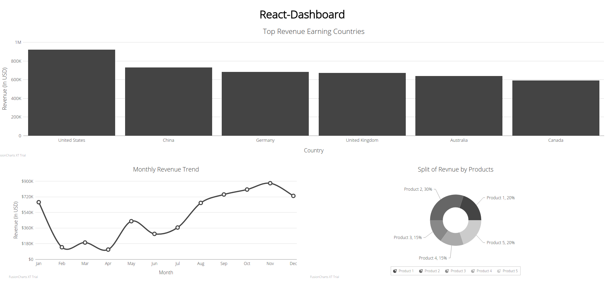

# React-Dashboard



## About
This project is React-Dashboard using react.js and fushion cart.
This React-Dashboard example is written by [Big Silver].

## Quick Start

```bash
# clone our repo
$ git clone https://github.com/Big-Silver/React-Dashboard.git React-Dashboard

# change directory to your app
$ cd React-Dashboard

# Run the D3.js app.

```
## index.html

```html
return (
    <div>
        <h1 className="main-title">React-Dashboard</h1>
        <div id="interactive-dashbaord"></div>
        <div className="chart-row">
        <div id="country-revenue">
            <react_fc.FusionCharts {...countryChartConfigs} />
        </div>
        </div>
        <div className="chart-row">
        <div id="monthly-revenue" className="inline-chart">
            <react_fc.FusionCharts {...monthlyChartConfigs} />
        </div>
        <div id="product-revenue" className="inline-chart">
            <react_fc.FusionCharts {...productChartConfigs} />
        </div>
        </div>
    </div>
);

```
